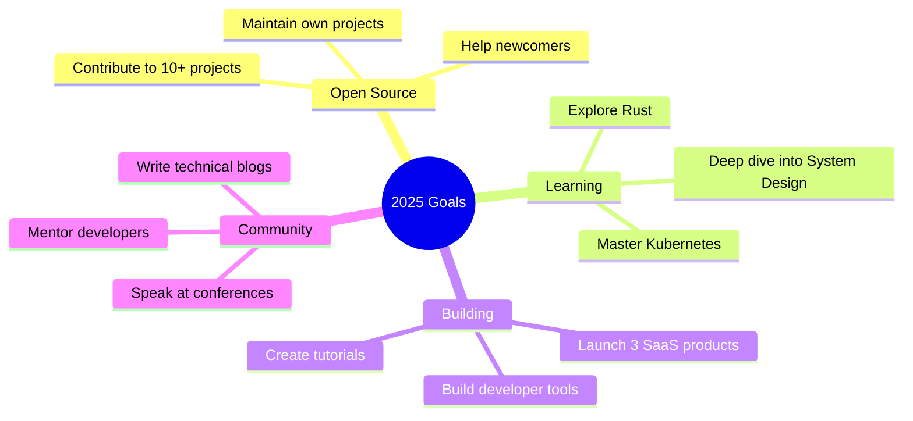

<div align="center">

<!-- Dynamic Header with Wave -->


<!-- Animated Typing -->
<a href="https://git.io/typing-svg"></a>

<a href="https://git.io/typing-svg"></a>

<br/>

<!-- Social Badges - Minimal & Clean -->
<p align="center">
  <a href="https://linkedin.com/in/yourprofile"></a>
  <a href="https://twitter.com/yourhandle"></a>
  <a href="mailto:your.email@example.com"></a>
  <a href="https://yourportfolio.com"></a>
  
</p>

</div>

<br/>

<!-- About Section -->
<details open>
<summary><h2>🧑‍💻 About Me</h2></summary>
<br/>

```yaml
name: Wisdom Njimogu
current_role: Full Stack Developer
company: currently Freelance

fields_of_interest:
  - software & web Development
  - Cloud Architecture
  - AI/ML
  - Open Source
  - DevOps

technical_background:
  - Software Engineering
  - System Design
  - API Development
  
currently_learning: ["Kubernetes", "Go", "System Design"]
hobbies: ["Coding", "Reading Tech Blogs", "Contributing to OSS"]
```

**💬 Ask me about:** Web Development, Cloud Architecture, APIs, System Design  
**📫 Reach me:**[njimoguwisdom@gmail.com](mailto:your.email@example.com)  
**⚡ Fun fact:** I think semicolons are optional in JavaScript and that's a hill I'm willing to debug on

</details>

<br/>

<!-- Tech Stack Section -->
<details open>
<summary><h2>🛠️ Tech Stack</h2></summary>
<br/>

<div align="center">

<!-- Languages -->
<table>
<tr>
<td align="center" width="96">

<br>C
</td>
<td align="center" width="96">

<br>JavaScript
</td>
<td align="center" width="96">

<br>TypeScript
</td>
<td align="center" width="96">

<br>Python
</td>
<td align="center" width="96">

<br>Java
</td>
</tr>
</table>

<!-- Frontend -->
**Frontend Development**


<!-- Backend -->
**Backend Development**


<!-- Database & Tools -->
**Database & DevOps**


<!-- Tools -->
**Tools & IDEs**


</div>

</details>

<br/>

<!-- GitHub Stats Section -->
<details open>
<summary><h2>📊 GitHub Analytics</h2></summary>
<br/>

<p align="center">


</p>

<p align="center">


</p>

<p align="center">

</p>

</details>

<br/>

<!-- Achievements Section -->
<details>
<summary><h2>🏆 GitHub Achievements</h2></summary>
<br/>

<p align="center">

</p>

</details>

<br/>

<!-- Featured Projects Section -->
<details>
<summary><h2>🚀 Featured Projects</h2></summary>
<br/>

<div align="center">

<!-- Replace with your actual repos -->
<table>
<tr>
<td width="50%">
<h3 align="center">Project Name 1</h3>
<div align="center">  
<a href="https://github.com/yourusername/project1" target="_blank"></a>
<p><strong>Tech Stack:</strong> React, Node.js, MongoDB</p>
<p>Brief description of what this project does and why it's awesome</p>
</div>
</td>
<td width="50%">
<h3 align="center">Project Name 2</h3>
<div align="center">  
<a href="https://github.com/yourusername/project2" target="_blank"></a>
<p><strong>Tech Stack:</strong> Python, FastAPI, PostgreSQL</p>
<p>Brief description of what this project does and why it's awesome</p>
</div>
</td>
</tr>
<tr>
<td width="50%">
<h3 align="center">Project Name 3</h3>
<div align="center">  
<a href="https://github.com/yourusername/project3" target="_blank"></a>
<p><strong>Tech Stack:</strong> Next.js, TypeScript, TailwindCSS</p>
<p>Brief description of what this project does and why it's awesome</p>
</div>
</td>
<td width="50%">
<h3 align="center">Project Name 4</h3>
<div align="center">  
<a href="https://github.com/yourusername/project4" target="_blank"></a>
<p><strong>Tech Stack:</strong> Go, Docker, Kubernetes</p>
<p>Brief description of what this project does and why it's awesome</p>
</div>
</td>
</tr>
</table>

</div>

</details>

<br/>

<!-- Current Focus Section -->
<details>
<summary><h2>🎯 Current Focus</h2></summary>
<br/>



**🔭 Currently Working On**
- Building a scalable microservices architecture with Go and Kubernetes
- Contributing to open-source projects in the cloud-native ecosystem
- Writing technical articles about system design and best practices

**🌱 Currently Learning**
- Advanced Kubernetes patterns and operators
- Distributed systems design
- Performance optimization techniques

**👯 Looking to Collaborate On**
- Open-source projects related to cloud infrastructure
- Developer tools and productivity apps
- Educational content for developers

</details>

<br/>

<!-- Blog Posts Section -->
<details>
<summary><h2>📝 Latest Blog Posts</h2></summary>
<br/>

<!-- BLOG-POST-LIST:START -->
- 🚀 [Building Scalable APIs: A Complete Guide](https://yourblog.com/post1)
- ⚡ [Understanding React Server Components in Depth](https://yourblog.com/post2)
- 🏗️ [My Journey into Microservices Architecture](https://yourblog.com/post3)
- 🔐 [Security Best Practices for Modern Web Apps](https://yourblog.com/post4)
- 🌐 [From Monolith to Microservices: A Case Study](https://yourblog.com/post5)
<!-- BLOG-POST-LIST:END -->

➡️ [Read more on my blog](https://yourblog.com)

</details>

<br/>

<!-- Fun Section -->
<details>
<summary><h2>⚡ Fun Zone</h2></summary>
<br/>

<div align="center">

### 💭 Dev Quote of the Day


<br/>

### 🐍 Contribution Snake
<picture>
  <source media="(prefers-color-scheme: dark)" srcset="https://raw.githubusercontent.com/yourusername/yourusername/output/github-contribution-grid-snake-dark.svg">
  <source media="(prefers-color-scheme: light)" srcset="https://raw.githubusercontent.com/yourusername/yourusername/output/github-contribution-grid-snake.svg">
  
</picture>

<br/>

### 😂 Random Dev Meme


</div>

</details>

<br/>

<!-- Connect Section -->
<div align="center">

## 🤝 Let's Connect

**I'm always interested in connecting with fellow developers, discussing new technologies, or collaborating on interesting projects!**

<p>
<a href="https://linkedin.com/in/wisdomnjimogu"></a>
<a href="https://twitter.com/weconett"></a>
<a href="mailto:your.njimoguwisdom@gmail.com"></a>
<a href="https://yourportfolio.com"></a>
</p>

<p align="center">
  
</p>

**⭐ Show some love by starring the repositories you find interesting!**

</div>
